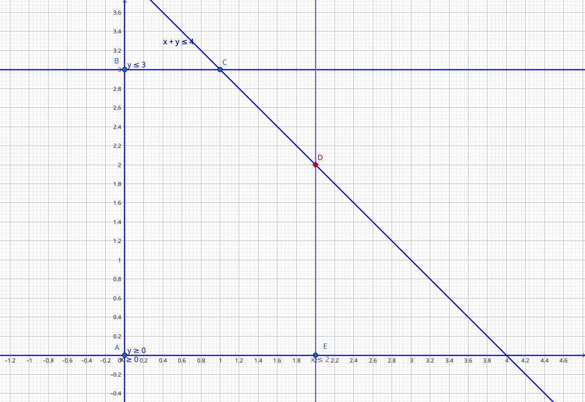

# Simplex Benchmark

Cross-language implementation and benchmark of the **two-phase Revised Simplex Method**, comparing Rust Python, Julia, C++, Go, and TypeScript.

---

## Goal

Each language implements the same algorithm against the same problem instances. The benchmark measures:

- **Wall-clock time** — median solve time over 10 runs, excluding I/O and JIT warm-up where applicable
- **Memory usage** — peak resident set size (RSS) during the solve

All implementations are allowed to use each language's idiomatic linear-algebra library for the basis solve step (`B \ N`): NumPy, Eigen, BLAS/LAPACK bindings, etc. The simplex logic itself — pivot selection, ratio test, anti-cycling — must be implemented from scratch.

---

## Languages

Each language has two benchmark variants: one using the language's external LA library for the basis solve `B⁻¹N`, and one with a **hand-rolled LU factorization** (partial pivoting, no external dependency) matching the existing TypeScript implementation.

| Language    | External LA library       | Hand-rolled LU benchmark         |
|-------------|---------------------------|----------------------------------|
| Julia       | `LinearAlgebra` (LAPACK)  | `julia/benchmark/bench_mps_lu.jl` |
| Python      | SciPy `lu_factor/lu_solve`| `python/benchmark/bench_mps_lu.py`|
| C++         | Eigen `PartialPivLU`      | `cpp/benchmark/bench_mps_lu.cpp` |
| Go          | Gonum `mat.LU` (pure Go)  | `go/cmd/bench_mps_lu/`           |
| Rust        | nalgebra `DMatrix::lu()`  | `rust/src/bin/bench_mps_lu.rs`   |
| TypeScript  | hand-rolled LU (only)     | `typescript/benchmark/bench_mps.ts` |

---

## Dataset — Netlib LP Test Suite

The benchmark uses problems from the [Netlib LP library](https://www.netlib.org/lp/data/), the canonical test suite for LP solvers. Problems are distributed in Netlib's compressed `emps` format (decoded by `scripts/decode_emps.py`, a Python port of David Gay's `emps.c`).

### Selected problems

| Problem    | Rows  | Columns | Optimal value  | Benchmark role  |
|------------|-------|---------|----------------|-----------------|
| `afiro`    | 27    | 51      | −464.753       | warm-up / correctness check |
| `blend`    | 74    | 114     | −30.812        | small timing target |
| `sc205`    | 205   | 317     | −52.202        | primary timing target |
| `ship04l`  | 402   | 2,118   | 1,793,091.56   | reference only (see below) |

`afiro`, `blend`, and `sc205` are solved correctly by all implementations and used as the primary timing targets. `ship04l` is referenced in the README but exceeds the practical limit of dense simplex without sparse LU — see [analysis.md](analysis.md#6-ship04l-exceeds-the-practical-limit-of-dense-simplex).

### Data files

The `.mps` files in `data/` are in Netlib's compressed emps format. Pre-parsed JSON is committed at `data/{name}.json`. To re-parse from the `.mps` files:

```bash
python scripts/decode_emps.py data/afiro.mps > /tmp/afiro_std.mps
# then re-run scripts/preparse_netlib.py (or the relevant section of run_benchmark.py)
```

---

## Benchmark Methodology

1. **Decode** — `scripts/decode_emps.py` converts Netlib's compressed emps format to standard MPS text.
2. **Parse** — `scripts/parse_mps.py` converts the MPS file to `(A, b, c)` in standard equality form; all implementations read the same pre-parsed JSON.
3. **Warm up** — JIT-compiled languages (Julia, TypeScript/V8) run two cold solves before timing begins.
4. **Time** — run 10 solves; record median and standard deviation.
5. **Memory** — measure peak RSS using `/usr/bin/time -v` (Linux).
6. **Verify** — check that the returned objective matches the known Netlib optimum to within 1e-4 relative error.

Results are written to `results/results.csv` by `scripts/run_benchmark.py`.

---

## Results

Median of 10 runs; peak RSS from `/usr/bin/time -v`. All results verified against known optima (relative tolerance 1e-4).

### Solve time (ms) on `sc205` (205×317, 42 pivot iterations)

| Implementation  | LA backend      | `afiro` | `blend`  | `sc205`    |
|-----------------|-----------------|---------|----------|------------|
| Go              | Gonum mat       | 0.72    | 28.3     | 377        |
| Julia           | LinearAlgebra   | 0.37    | 28.4     | 389        |
| Python          | SciPy/OpenBLAS  | 1.78    | 39.4     | 445        |
| C++             | Eigen           | 0.36    | 22.4     | 638        |
| Rust            | nalgebra        | 0.50    | 29.5     | 783        |
| TypeScript      | hand-rolled LU  | 5.65    | 257      | 5,485      |
| C++-LU          | hand-rolled LU  | 0.76    | 63.5     | 2,052      |
| Rust-LU         | hand-rolled LU  | 1.91    | 195      | 7,159      |
| Go-LU           | hand-rolled LU  | 1.98    | 182      | 6,741      |
| Julia-LU        | hand-rolled LU  | 5.88    | 477      | 14,801     |
| Python-LU       | hand-rolled LU  | 77.6    | 3,344    | timeout    |

### Peak RSS on `sc205`

| Implementation | RSS (MB) |
|----------------|----------|
| Rust-LU        | 6.9      |
| C++-LU         | 7.3      |
| Rust           | 8.2      |
| C++            | 8.9      |
| Go-LU          | 11.2     |
| Go             | 13.6     |
| Python-LU      | 32.6     |
| Python         | 61.3     |
| TypeScript     | 231.7    |
| Julia          | 456.9    |
| Julia-LU       | 511.0    |

For detailed analysis see [analysis.md](analysis.md).

---

## How the Algorithm Works

All six implementations follow the same specification.

### Core Idea

The feasible region of an LP is a convex polytope. Optimal solutions always occur at a **vertex** (basic feasible solution). The algorithm moves from vertex to vertex along edges, strictly improving the objective, until it reaches the optimum.


*Figure: Optimal solutions lie at vertices; each pivot moves along an edge to a neighboring vertex with higher objective (until none improve).*

A **basis** B is a set of m linearly independent columns of A that fully determine a vertex: the basic variables are `x_B = B⁻¹b` and all non-basic variables are zero.

### Phase 1 — Finding a Feasible Starting Point

Before optimizing, we need a basic feasible solution. Phase 1 constructs an auxiliary problem by adding **artificial variables** w:

```
maximize  -sum(w)
subject to [A | I] [x; w] = b,  x,w >= 0
```

Any row with `b[i] < 0` is negated first so that `b ≥ 0` holds, making the all-artificials basis `w = b` immediately feasible. Phase 1 then runs the simplex iterations. If it terminates with objective value 0, the artificials are driven out and we have a BFS for the original problem. Otherwise the problem is **infeasible**.

### Phase 2 — Optimizing

Given the BFS from Phase 1, Phase 2 iterates:

1. **Compute reduced costs** `c_r = c_N' - c_B' B⁻¹ N`
2. **Optimality check** — if all `c_r <= 0`, the current vertex is optimal; stop.
3. **Entering variable** — pick the non-basic variable j with the largest (most positive) reduced cost (`argmax(c_r)`).
4. **Ratio test (leaving variable)** — compute `θ = min { x_B[i] / (B⁻¹ A_j)[i] : (B⁻¹ A_j)[i] > 0 }`. The basic variable achieving the minimum leaves the basis.
   - If no ratio is finite, the problem is **unbounded** in direction d.
5. **Pivot** — swap the entering and leaving variables; update x and the index sets.

### Anti-Cycling: Lexicographic Rule

When the ratio test produces a tie (degenerate pivot), the algorithm could cycle forever. This implementation breaks ties using the **lexicographic smallest** rule: among tied rows, the one that is lexicographically smallest in the scaled non-basic matrix `N / (B⁻¹ A_j)[i]` is chosen, guaranteeing finite termination.

### Return Values

| Value    | Meaning |
|----------|---------|
| `x`      | Optimal point (or extreme ray if unbounded) |
| `z`      | Objective value at optimum |
| `status` | `1` = optimal, `-1` = unbounded, `-2` = iteration limit reached |
| `it`     | Number of pivot iterations |

---

## Complexity

### Worst Case: Exponential

Simplex is **not** a polynomial-time algorithm. The Klee-Minty cube (1972) is a family of LP instances where the standard simplex method (with the largest-coefficient pivot rule) visits all 2ⁿ vertices before finding the optimum. So worst-case complexity is **O(2ⁿ)**.

No pivot rule has ever been proven to make simplex polynomial in the worst case, and finding one remains an open problem.

### LP is in P

Even though simplex itself is not polynomial, **Linear Programming as a problem is in P**:

- **Ellipsoid Method** (Khachiyan, 1979) — first polynomial-time LP algorithm, theoretically important but slow in practice.
- **Interior Point Methods** (Karmarkar, 1984) — polynomial and competitive with simplex on large dense problems.

LP is therefore **not NP-complete**, and not believed to be NP-hard.

### Integer LP is NP-Complete

When variables are restricted to integers (**ILP**), the problem becomes NP-complete. In practice, ILP solvers use simplex heavily — they solve LP *relaxations* (dropping the integrality constraints) inside a branch-and-bound search tree, making fast LP solving critical.

### Why Simplex Dominates in Practice: Smoothed Complexity

The gap between exponential worst case and fast practical performance was formally explained by Spielman & Teng (2004) with the concept of **smoothed complexity**: if you add an arbitrarily small random perturbation to any problem instance, the expected number of pivot steps becomes polynomial. Real-world data is never adversarially constructed, so simplex behaves well on it.

### Open Problem: Strongly Polynomial LP

Whether LP can be solved in time polynomial in m and n alone — independent of the magnitude of the coefficients — is still **unknown**. This is one of Smale's Millennium problems for mathematics and theoretical CS.
