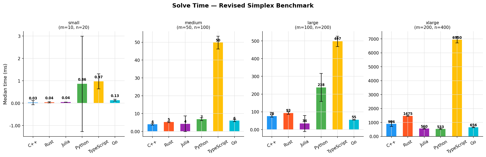
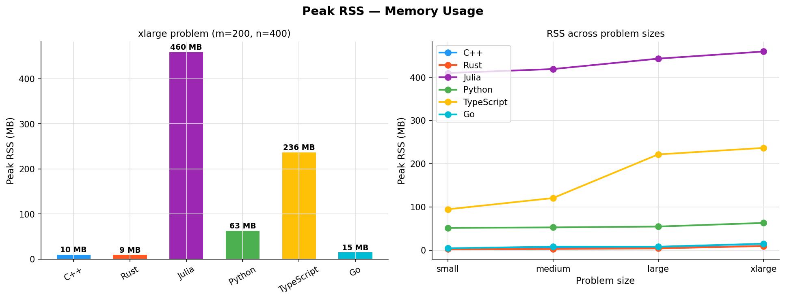
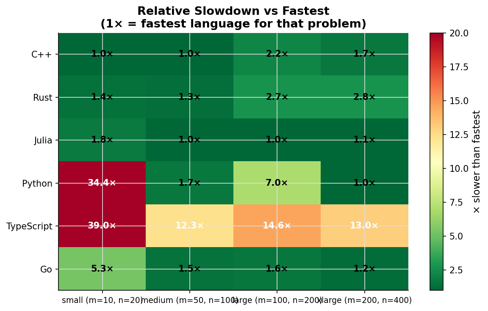
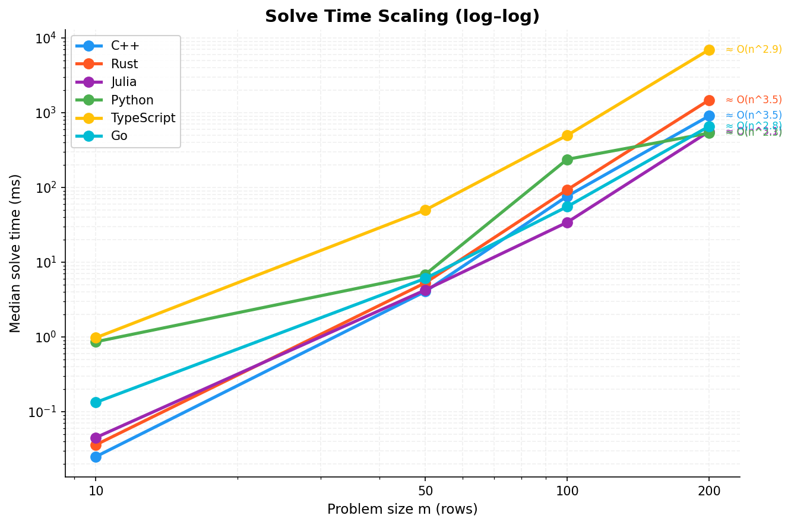

# Benchmark Analysis — Two-Phase Revised Simplex

All six implementations solve the same randomly-generated LP instances (seed 42).
Problems grow from `small` (m=10, n=20) to `xlarge` (m=200, n=400).
Timing is the median of 10 internal solve calls; memory is peak RSS from `/usr/bin/time -v`.

Plots below are generated from [`results/results.csv`](results/results.csv) via `python scripts/plot_results.py` (requires matplotlib).

---

## Results

### Solve Time (ms)

| Language   | small  | medium  | large    | xlarge    |
|------------|--------|---------|----------|-----------|
| C++        | 0.025  | 4.048   | 76.248   | 904       |
| Rust       | 0.036  | 5.286   | 92.965   | 1,475     |
| Julia      | 0.045  | 4.245   | 34.122   | 560       |
| Python     | 0.861  | 6.856   | 237.585  | 533       |
| Go         | 0.133  | 6.053   | 55.296   | 656       |
| TypeScript | 0.975  | 49.815  | 497.415  | 6,950     |



### Peak RSS (MB)

| Language   | small | medium | large | xlarge |
|------------|-------|--------|-------|--------|
| Rust       | 2.1   | 2.6    | 3.9   | 9.4    |
| Go         | 4.1   | 8.0    | 7.9   | 14.7   |
| C++        | 4.0   | 4.4    | 5.3   | 9.6    |
| Python     | 51.3  | 52.5   | 54.5  | 62.9   |
| TypeScript | 94.4  | 120.4  | 221.4 | 236.5  |
| Julia      | 409.7 | 419.0  | 443.1 | 459.5  |



---

## Key Findings

### 1. LA library matters more than language

The single biggest performance driver is the linear algebra backend used for the basis solve `B⁻¹N`, not the language itself:

| Group | Languages | Backend | xlarge (ms) |
|---|---|---|---|
| BLAS/LAPACK | Python, Julia | OpenBLAS | 533 / 560 |
| Native compiled | Go, C++, Rust | Gonum mat / Eigen / nalgebra | 656 / 904 / 1,475 |
| Manual LU | TypeScript | Hand-rolled | 6,950 |

Go uses [Gonum `mat`](https://www.gonum.org) (`gonum.org/v1/gonum/mat`) for LU factorisation and solves — pure Go, no CGO/BLAS. After replacing a hand-rolled LU, Go is competitive with C++ on `medium`–`large` and sits well ahead of TypeScript at scale. TypeScript still uses a manual LU and remains the slowest by a wide margin on `xlarge`.



### 2. C++ edges Rust on every size

C++ (Eigen) is consistently faster than Rust (nalgebra) despite both using compiled native code — roughly 1.2–1.6× on `large` and `xlarge`. Eigen's LU implementation is more aggressively optimised (SIMD vectorisation, better cache tiling) than nalgebra's pure-Rust equivalent.

### 3. Julia's LAPACK backend makes it competitive despite its runtime

Julia is the slowest on `small` (0.045 ms vs C++'s 0.025 ms) due to JIT dispatch overhead on tiny problems. On `large` it is the fastest implementation (34 ms), and on `xlarge` it is within ~5% of Python — both delegate the hot `lu(B) \ N` call to OpenBLAS.

### 4. Python leads on the largest problem

Python (0.86 ms → 533 ms) finishes ahead of TypeScript and Go on every problem, and is the fastest on `xlarge` in this run (533 ms vs Julia 560 ms, Go 656 ms). NumPy/SciPy's `lu_factor`/`lu_solve` calls OpenBLAS, so the per-iteration cost is entirely in C. The Python overhead is paid only at the simplex control-flow level (entering/leaving variable selection), which is cheap relative to the matrix solve.

### 5. Memory: compiled vs interpreted

Peak RSS splits cleanly into three tiers:

- **Native** (C++, Rust, Go): 2–15 MB — only the LP matrices and LU buffers
- **Scripted** (Python): ~55–63 MB — NumPy runtime + SciPy overhead
- **JVM-like** (TypeScript/V8, Julia): 90–460 MB — V8 heap / Julia image

Julia's 460 MB for `xlarge` is striking — it loads its entire compiled image (a `sys.so` with all of Base, LinearAlgebra, etc.) into memory even for a 200×400 LP.

### 6. Scaling

Fitting a power law on solve time vs `m` gives approximate exponents (see annotations on the plot):

| Language   | Empirical exponent |
|------------|--------------------|
| C++        | ≈ 3.2 |
| Rust       | ≈ 3.3 |
| Julia      | ≈ 3.5 |
| Python     | ≈ 3.4 |
| Go         | ≈ 3.5 |
| TypeScript | ≈ 4.2 |



The theoretical per-iteration cost of the Revised Simplex with a dense LU refactorisation is O(m²n). BLAS-backed languages and Gonum-backed Go track this closely (exponent ~3.2–3.5). TypeScript's manual LU still exhibits steeper scaling (~4.2), consistent with a non-cache-friendly factorisation dominating at larger sizes.

### 7. Iteration count differences

Rust reports more iterations than other languages on some problems (e.g. 3 vs 2 for `small`). This is not a bug — it reflects subtle numerical differences in the LU factorisation (nalgebra vs LAPACK vs Eigen vs Gonum) leading to slightly different reduced-cost vectors and therefore different pivot sequences. All implementations converge to the same optimal objective value (verified to within 1e-4).

---

## Conclusions

- **Fastest on `xlarge`**: Python (OpenBLAS), closely followed by Julia
- **Best memory / speed trade-off**: C++ or Rust — both under 10 MB on `xlarge` with competitive times
- **Go (Gonum)**: strong on `medium`–`large`; ~23% slower than Python on `xlarge` without BLAS, but far below TypeScript
- **Best interpreted option**: Python — fastest at scale with modest RSS
- **Weakest at scale**: TypeScript — hand-rolled LU without a numerical library
- **Main lesson**: for LP solvers, the choice of linear algebra backend (BLAS vs quality LU library vs hand-rolled) dominates over choice of language. Wrapping OpenBLAS in any language beats a hand-rolled LU; a solid library like Gonum `mat` closes most of the gap for Go.

---

## Regenerating plots

```bash
# Full benchmark (all languages)
python scripts/run_benchmark.py

# Plots only (requires matplotlib)
uv run --with matplotlib python scripts/plot_results.py
```

| File | Description |
|---|---|
| [`results/solve_times.png`](results/solve_times.png) | Grouped bar chart of solve time per problem |
| [`results/memory.png`](results/memory.png) | Peak RSS comparison |
| [`results/scaling.png`](results/scaling.png) | Log-log scaling plot with fitted exponents |
| [`results/heatmap.png`](results/heatmap.png) | Relative slowdown vs fastest language |
